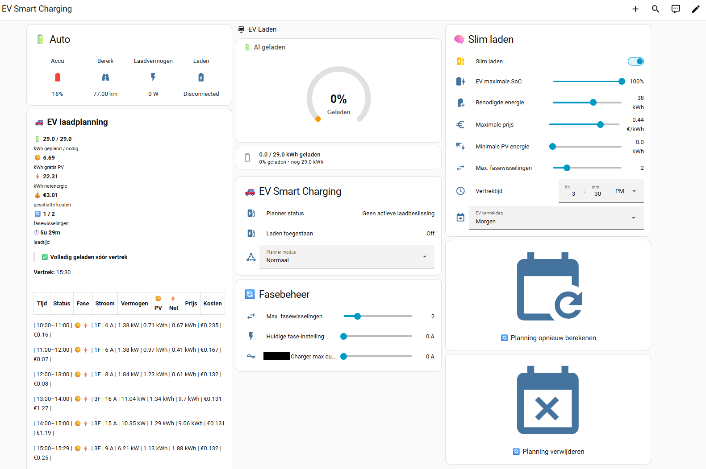

# EV Planner

Native Home Assistant custom integration for EV charging planning using electricity prices and PV forecasts.

## Dashboard



## What it does

EV Planner calculates **when and how much** an EV should charge before a configured departure time.

It combines:

- electricity price data;
- Solcast PV forecasts;
- required charging energy;
- a maximum grid-price limit;
- a minimum usable PV-energy setting;
- a configurable phase-switch budget;
- the electrical limits configured for the planner.

**EV Planner does not control the physical charger.** It does not switch a charger on/off, set charging current, change phases, or detect whether an EV is connected. Those actions remain Home Assistant automation responsibilities.

## Installation

### HACS

Add this GitHub repository as a custom HACS repository with category **Integration**.

After installation, restart Home Assistant. The integration will be available under:

**Settings → Devices & services → Add integration → EV Planner**

### Manual

Copy:

```text
custom_components/ev_planner/
```

to:

```text
/config/custom_components/ev_planner/
```

Restart Home Assistant and add **EV Planner** from the integration UI.

## Configuration

EV Planner uses a config flow and options flow. The following existing Home Assistant entities are selected during configuration:

| Setting | Entity type |
|---|---|
| Departure time | `input_datetime` |
| Departure day | `input_select` |
| Energy needed | `input_number` |
| Maximum grid price | `input_number` |
| Minimum usable PV | `input_number` |
| Maximum phase switches | `input_number` |
| Planner mode | `input_select` |
| Electricity prices | `sensor` |
| Solcast today | `sensor` |
| Solcast tomorrow | `sensor` |
| Maximum charging power | numeric setting |

The default entity IDs are compatible with the original EV Planner/Pyscript setup. They can be changed through the integration configuration.

## Entities

The integration provides:

- **Smart Charging switch** — enables/disables planner operation. It is not a charger control.
- **State sensor** — reports the current planner state.
- **Data sensor** — exposes the complete current plan as state attributes.
- **Charging Allowed binary sensor** — read-only indication that the current planner window permits charging.

Home Assistant may assign the final entity IDs through its entity registry. Use the registry/UI when referencing entities from automations.

## Services

### `ev_planner.update`

Runs one planner update cycle.

The integration intentionally does **not** start its own periodic background loop. Call this service from your own automation when appropriate.

### `ev_planner.create_plan`

Creates a new charging plan from the current inputs.

### `ev_planner.replan`

Clears the current plan and creates a new one.

### `ev_planner.clear_plan`

Clears the current plan.

### `ev_planner.status`

Returns the current runtime status. The service supports Home Assistant response data.

### `ev_planner.dashboard`

Returns the current planner/dashboard data. The service supports Home Assistant response data.

## Recommended architecture

```text
Home Assistant automation
        │
        ├── EV connected / planning trigger
        ├── update EV SOC / required energy
        └── ev_planner.create_plan
                    │
                    ▼
             ┌─────────────┐
             │  EV Planner │
             └──────┬──────┘
                    │
             planner outputs
                    │
        ┌───────────┴───────────┐
        ▼                       ▼
sensor.ev_planner_data   charging_allowed
                                │
                                ▼
                       Your HA automation
                                │
                    ┌───────────┴───────────┐
                    ▼                       ▼
               charger on/off         current / phase
```

This separation is intentional. The planner is the decision layer; Home Assistant automations are the physical charger control layer.

## Dashboard example

EV Planner can be combined with standard Home Assistant cards and, optionally, custom dashboard cards. The example below deliberately uses **generic placeholder entity IDs** so it can be adapted to different EVs, chargers and Home Assistant installations.

The example assumes that the EV Planner entities have the following names after entity-registry configuration:

- `sensor.ev_planner_data`
- `sensor.ev_planner_state`
- `binary_sensor.ev_planner_charging_allowed`
- `switch.ev_planner_smart_charging`

The other entities are examples only. Replace them with the entities provided by your own EV, charger and Home Assistant helpers.

```yaml
views:
  - title: EV Smart Charging
    path: ev-smart-charging
    icon: mdi:car-electric
    type: masonry
    cards:
      - type: glance
        title: 🔋 Auto
        columns: 4
        entities:
          - entity: sensor.ev_battery_level
            name: Accu
            icon: mdi:battery
          - entity: sensor.ev_range
            name: Bereik
            icon: mdi:road-variant
          - entity: sensor.ev_charge_power
            name: Laadvermogen
            icon: mdi:flash
          - entity: sensor.ev_charger_mode
            name: Laden
            icon: mdi:battery-charging

      - type: entities
        title: 🧠 Slim laden
        show_header_toggle: false
        entities:
          - entity: switch.ev_planner_smart_charging
            name: Slim laden
          - entity: input_number.ev_kwh_needed
            name: Benodigde energie
            icon: mdi:battery-plus
          - entity: input_number.ev_max_price
            name: Maximale prijs
            icon: mdi:currency-eur
          - entity: input_number.ev_min_pv_kwh
            name: Minimale PV-energie
            icon: mdi:solar-power
          - entity: input_number.ev_max_phase_switches
            name: Max. fasewisselingen
            icon: mdi:swap-horizontal
          - entity: input_datetime.ev_departure_time
            name: Vertrektijd
            icon: mdi:clock-outline
          - entity: input_select.ev_departure_day
            name: Vertrekdag

      - type: entities
        title: 🚗 EV Planner
        show_header_toggle: false
        entities:
          - entity: sensor.ev_planner_state
            name: Planner status
            icon: mdi:ev-station
          - entity: binary_sensor.ev_planner_charging_allowed
            name: Laden toegestaan
            icon: mdi:ev-station
          - entity: input_select.ev_planner_mode
            name: Planner modus
            icon: mdi:state-machine

      - type: markdown
        content: >-
          
          
          
          
          
          
          
          
          
          
          
          
          {% set mins = (minutes % 60) | round(0) | int %}

          ## 🚗 EV laadplanning

          **{{ planned | round(1) }} / {{ needed | round(1) }} kWh** gepland / nodig  
          ☀️ {{ free | round(2) }} kWh PV · ⚡ {{ paid | round(2) }} kWh net · 💰 €{{ cost | round(2) }} · 🔄 {{ switches }}/{{ max_switches }} fasewisselingen · ⏱ {{ hours }}u {{ mins }}m

          
          > ⚠️ **Niet volledig haalbaar:** nog {{ missing | round(2) }} kWh nodig.
          
          > ✅ **Volledig geladen vóór vertrek**
          

          
          **Vertrek:** {{ as_datetime(departure).strftime('%H:%M') }}
          

          | Tijd | Status | Fase | Stroom | Vermogen | ☀️ PV | ⚡ Net | Prijs | Kosten |
          |:---|:---:|:---:|---:|---:|---:|---:|---:|---:|
          
            
            
            
            
            
            
            
            
            
            
            
              
              
              
          | {{ start.strftime('%H:%M') }}–{{ end.strftime('%H:%M') }} | {{ status }} | {{ phase_text }} | {{ current }} A | {{ power | round(2) }} kW | {{ pv | round(2) }} kWh | {{ grid | round(2) }} kWh | €{{ price | round(3) }} | €{{ hour_cost | round(2) }} |
            
          

          **Legenda:** ☀️ PV = gratis zonne-energie · ⚡ = netenergie · 🔄 = fasewissel

      - type: button
        name: 🔄 Planning opnieuw berekenen
        icon: mdi:calendar-refresh
        tap_action:
          action: perform-action
          perform_action: ev_planner.replan
          target: {}

      - type: button
        name: 🗑️ Planning verwijderen
        icon: mdi:calendar-remove
        tap_action:
          action: perform-action
          perform_action: ev_planner.clear_plan
          target: {}
```

### Dashboard notes

The dashboard example is intentionally split into two layers:

1. **EV/charger information** — battery, range, charging power and charger state come from the user's own EV and charger integrations.
2. **EV Planner information** — planner state, charging permission, planning inputs and `sensor.ev_planner_data` come from EV Planner.

The `charging_allowed` entity is an **advisory planner output**. It is not a command to the charger. Your own Home Assistant automation decides how that output is translated into charger on/off, current or phase control.

If you use custom cards such as Mushroom or ApexCharts, they can be added around the same generic EV Planner entities. They are not required for EV Planner itself.

## Planner output

`sensor.ev_planner_data` contains the plan summary and decision information, including:

- required energy;
- planned energy;
- missing energy;
- free PV energy;
- paid grid energy;
- estimated cost;
- completeness;
- departure time;
- maximum price;
- charging-window count;
- phase-switch count;
- total charging minutes;
- individual charging decisions.

Each decision contains the source hour and the charging settings calculated by the planner.

## Electrical limits

The current planner configuration uses:

- 230 V;
- 6–16 A integer charging current;
- 1-phase and 3-phase charging;
- maximum 11.04 kW;
- a configurable phase-switch limit with the planner's hard safety cap.

The planner reads the technical limits from its central configuration.

## Data sources

EV Planner currently integrates with data provided by other Home Assistant integrations:

- **Solcast** — provides the predicted hourly solar/PV production used by EV Planner to determine when solar energy is available.
- **Zonneplan** — provides the electricity price forecast used by EV Planner to calculate the cost of grid charging.

These integrations are therefore part of the current recommended setup for EV Planner. The EV Planner configuration does not hard-code their entity IDs: you select the relevant Home Assistant sensors during configuration, so the entity names can differ between installations.

The planner is deliberately separated from these data providers. Solcast and Zonneplan provide the forecast data; EV Planner combines that data with the required charging energy, departure time and charging constraints to produce a charging plan.

## Troubleshooting

1. Open **Settings → Devices & services → EV Planner**.
2. Verify all configured input entities exist.
3. Check that the Solcast forecast sensors contain hourly forecast data.
4. Check that the price sensor contains the expected price forecast.
5. Check that departure time/day and required energy contain valid values.
6. Call `ev_planner.create_plan` manually.
7. Inspect `sensor.ev_planner_state` and `sensor.ev_planner_data`.
8. Check Home Assistant logs for `EV Planner`.
9. Verify that your automations, not the integration, operate the physical charger.

## Development

Install development dependencies:

```bash
python -m pip install -r requirements_test.txt
```

Run all tests:

```bash
pytest
```

Run linting:

```bash
ruff check .
```

The repository contains both core unit tests and Home Assistant integration tests. The Home Assistant tests use `pytest-homeassistant-custom-component`.

## Project layout

```text
.
├── custom_components/
│   └── ev_planner/
│       ├── __init__.py
│       ├── binary_sensor.py
│       ├── config_flow.py
│       ├── const.py
│       ├── manifest.json
│       ├── sensor.py
│       ├── services.yaml
│       ├── strings.json
│       ├── switch.py
│       ├── translations/
│       └── core/
├── tests/
├── .github/
│   └── workflows/
├── hacs.json
├── LICENSE
├── pyproject.toml
└── requirements_test.txt
```

## License

MIT. See [LICENSE](LICENSE).
